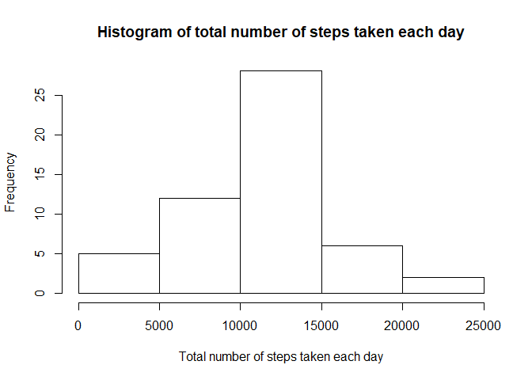
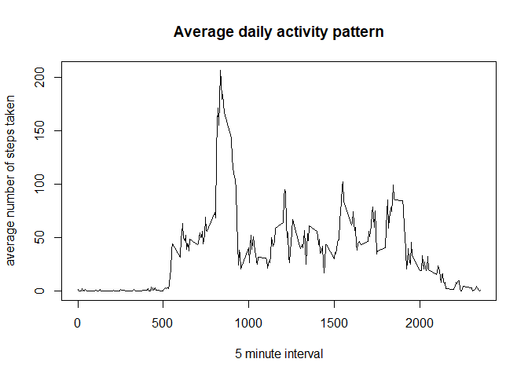
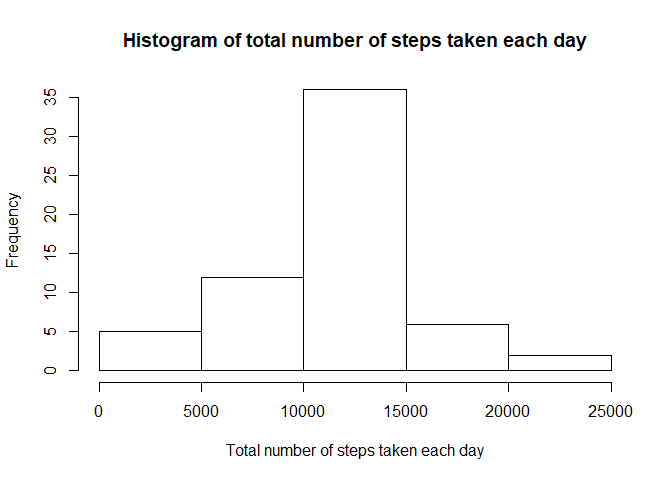
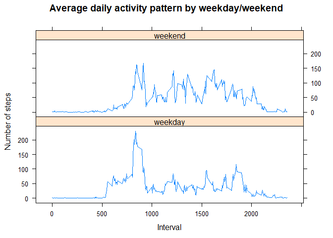

Set global options


```r
knitr::opts_chunk$set(echo=TRUE)
```


## Loading and preprocessing the data

1. Download data from [Activity monitoring data](https://d396qusza40orc.cloudfront.net/repdata%2Fdata%2Factivity.zip), unzip it and load it into *activity* data frame 


```r
zipfile <- "activity.zip"
if (!file.exists(zipfile)) {
     download.file("https://d396qusza40orc.cloudfront.net/repdata%2Fdata%2Factivity.zip",
                   destfile = zipfile)
}
csvfile <- "activity.csv"
if (!file.exists(csvfile))
     unzip(zipfile)
activity <- read.csv(csvfile)
str(activity)
```

```
## 'data.frame':	17568 obs. of  3 variables:
##  $ steps   : int  NA NA NA NA NA NA NA NA NA NA ...
##  $ date    : Factor w/ 61 levels "2012-10-01","2012-10-02",..: 1 1 1 1 1 1 1 1 1 1 ...
##  $ interval: int  0 5 10 15 20 25 30 35 40 45 ...
```

2. Process/transform the data (if necessary) into a format suitable

None

## What is mean total number of steps taken per day?

1. Calculate the total number of steps taken per day


```r
totsteps <- aggregate(steps~date, data=activity, sum)
```

2. Make a histogram of the total number of steps taken each day


```r
hist(totsteps$steps, 
     xlab="Total number of steps taken each day", 
     main="Histogram of total number of steps taken each day")
```

<!-- -->

3. Calculate and report the mean and median of the total number of steps taken per day


```r
mn <- mean(totsteps$steps)
print(mn)
```

```
## [1] 10766.19
```

```r
md <- median(totsteps$steps)
print(md)
```

```
## [1] 10765
```

The mean of the total number of steps taken per day is **10766.19** and the median is **10765**

## What is the average daily activity pattern?

1. Make a time series plot of the 5-minute interval (x-axis) and the average number of steps taken, averaged across all days (y-axis)


```r
avgsteps <- aggregate(steps~interval, data=activity, mean)
plot(avgsteps$interval, avgsteps$steps, 
     type="l",
     xlab="5 minute interval",
     ylab="average number of steps taken",
     main="Average daily activity pattern")
```

<!-- -->


2. Which 5-minute interval, on average across all the days in the dataset, contains the maximum number of steps?


```r
av <- avgsteps[which.max(avgsteps$steps), ]$interval
print(av)
```

```
## [1] 835
```

The 5-minute interval which contains the maximum number of steps is **835**

## Imputing missing values

1. Calculate and report the total number of missing values in the dataset (i.e. the total number of rows NAs)


```r
mv <- sum(is.na(activity$steps))
print(mv)
```

```
## [1] 2304
```

The total number of missing values in the dataset is **2304**

2. Devise a strategy for filling in all of the missing values in the dataset. The strategy does not need to be sophisticated. For example, you could use the mean/median for that day, or the mean for that 5-minute interval, etc.

I am going to use the mean for each 5 minute interval because NA values are in full days, therfore there is no average or median for those days

3. Create a new dataset that is equal to the original dataset but with the missing data filled in.


```r
newactivity <- activity
for (i in 1:nrow(newactivity))
     if (is.na(newactivity[i,]$steps))
          newactivity[i,]$steps <-avgsteps[which(avgsteps$interval==newactivity[i,]$interval),]$steps
```

4. Make a histogram of the total number of steps taken each day and Calculate and report the mean and median total number of steps taken per day. Do these values differ from the estimates from the first part of the assignment? What is the impact of imputing missing data on the estimates of the total daily number of steps?


```r
totsteps <- aggregate(steps~date, data=newactivity, sum)
hist(totsteps$steps, 
     xlab="Total number of steps taken each day", 
     main="Histogram of total number of steps taken each day")
```

<!-- -->

```r
mean(totsteps$steps)
```

```
## [1] 10766.19
```

```r
median(totsteps$steps)
```

```
## [1] 10766.19
```

The mean was not impacted by imputing missing data because now the mean of each day with NA vales is the mean of all days without NA values.

However, the median changed respect to the original value because now there are more days with data with the average per day.

## Are there differences in activity patterns between weekdays and weekends?

1. Create a new factor variable in the dataset with two levels – “weekday” and “weekend” indicating whether a given date is a weekday or weekend day.


```r
##dtype <- function(x){
##     if (as.numeric(format(as.Date(x), "%u")) > 5) as.factor("weekend") else as.factor("weekday")
##}
##for (i in 1:nrow(newactivity))
##     newactivity[i,]$daytype <- dtype(newactivity[i,]$date)
newactivity$daytype <- ifelse(as.numeric(format(as.Date(newactivity$date), "%u")) > 5, "weekend" , "weekday" )
```


2. Make a panel plot containing a time series plot of the 5-minute interval (x-axis) and the average number of steps taken, averaged across all weekday days or weekend days (y-axis). See the README file in the GitHub repository to see an example of what this plot should look like using simulated data.


```r
avgsteps <- aggregate(steps~interval+daytype, data=newactivity, mean)
library(lattice)
xyplot(steps~interval|daytype,
     data=avgsteps,
     type="l",
     xlab="Interval",
     ylab="Number of steps",
     main="Average daily activity pattern by weekday/weekend",
     layout=c(1,2))
```

<!-- -->

